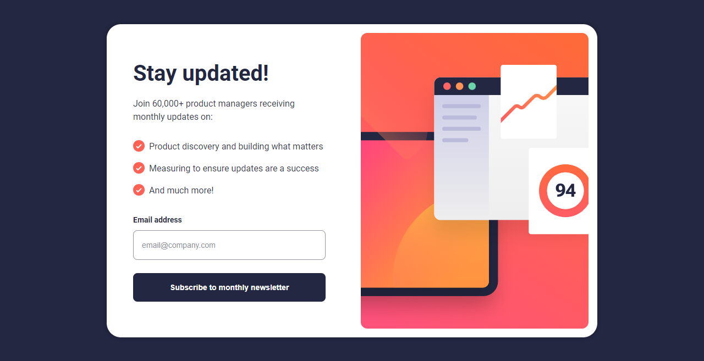

  

  <h2>QR code component</h2>

  <h3>
    <a href="">
      <strong>Frontend Mentor</strong>
    </a>
  </h3>

   

  

    <a href="">View Demo</a>
    -
    <a href="">Report Bug</a>
    -
    <a href="">Request Feature</a>
  

#

This is a solution to the [QR code component challenge on Frontend Mentor](https://www.frontendmentor.io/challenges/qr-code-component-iux_sIO_H). Frontend Mentor challenges help you improve your coding skills by building realistic projects.

<h2>Links</h2>

- Solution URL: [Newsletter sign-up form with success message | Frontend Mentor]()
- Live Site URL: 

 

## Table of contents

- 
  - [Table of contents](#table-of-contents)
  - [Overview](#overview)
    - [The challenge](#the-challenge)
    - [Screenshot](#screenshot)
  - [My process](#my-process)
    - [Built with](#built-with)
  - [Author](#author)

## Overview

### The challenge

Users should be able to:

- Distinguish between "unread" and "read" notifications
- Select "Mark all as read" to toggle the visual state of the unread notifications and set the number of unread messages to zero
- View the optimal layout for the interface depending on their device's screen size
- See hover and focus states for all interactive elements on the page

### Screenshot

## My process

### Built with

- Semantic HTML5 markup
- Mobile-first workflow

## Author

- Frontend Mentor - [@JenaCarry](https://www.frontendmentor.io/profile/JenaCarry)
- LinkedIn - [Jean Dias](https://www.linkedin.com/in/jean-dias-0900a1260/)
